<!-- Kaan Organic Feedback session July 9th (docx v5), extracted verbatim by watchtower.
     Images in ./media/ appear in original document order. -->

# Kaan organic feedback - July 9

Nexus Organic Feedback Session — July 9, 5:30 PM

Feedback A

Company Management and Deletion

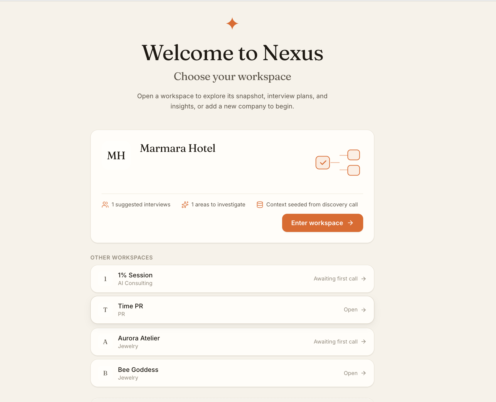

This page should allow us to reorder companies using drag and drop and delete individual companies. It should also include a carefully designed “Delete company” option for permanently removing a company and its associated data. We need to define exactly how this action affects the database before implementing it.

(Place Alternative UI Here)

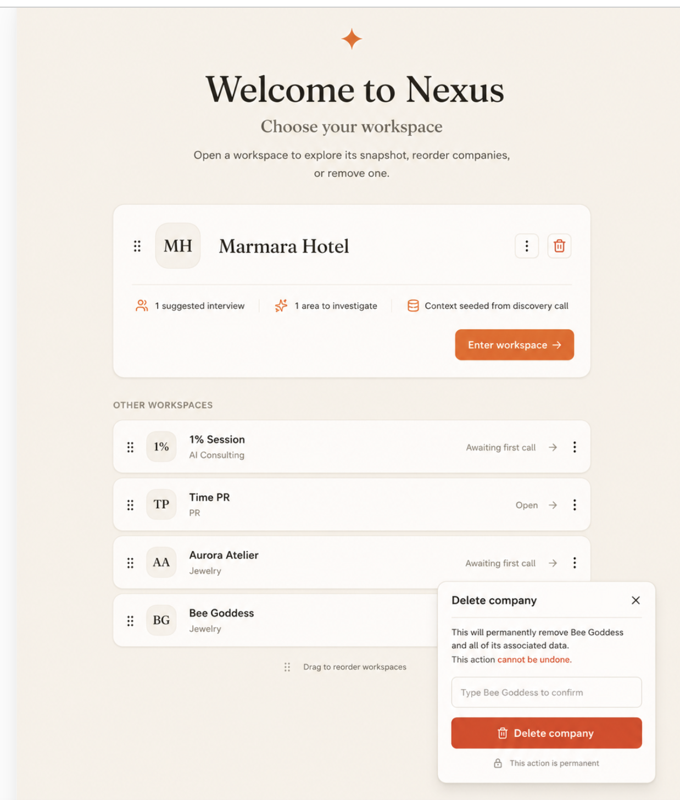

Keep the existing checkbox interaction and supporting images in the redesigned version.

Feedback B

Post-Call Company Snapshot

After a call is completed, Nexus should take the user to a page like this. This page should only appear after a context call is completed or sufficient company context has been provided, such as through a pasted transcript or uploaded file. This is the user’s introduction to the company snapshot. The current mock-up incorrectly shows the Interviews tab; if this is the user’s first time opening the workspace, the Home tab should be active.

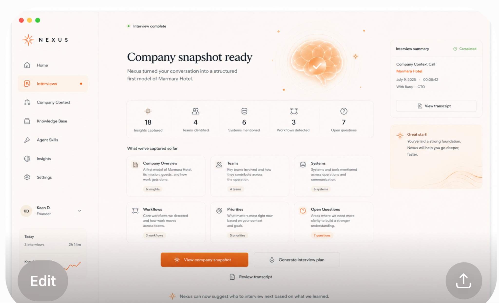
Remove the “Generate interview plan” and “Review transcript” actions from the bottom. The only primary action should be “View company snapshot.”

After the user clicks “View company snapshot,” the snapshot should open in a cleaner, more structured layout. The current snapshot UI feels cluttered and needs to be reorganized to match the example below.

Feedback C

Workflows Navigation and Detail View

The current Workflows tab immediately displays every workflow. Instead, I first considered showing a department-selection screen where users could choose Sales, Marketing, Operations, or another department before viewing its workflows.

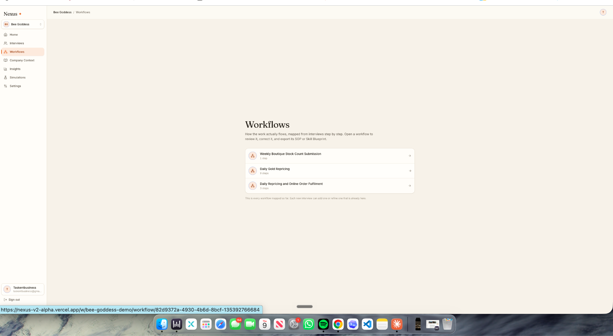

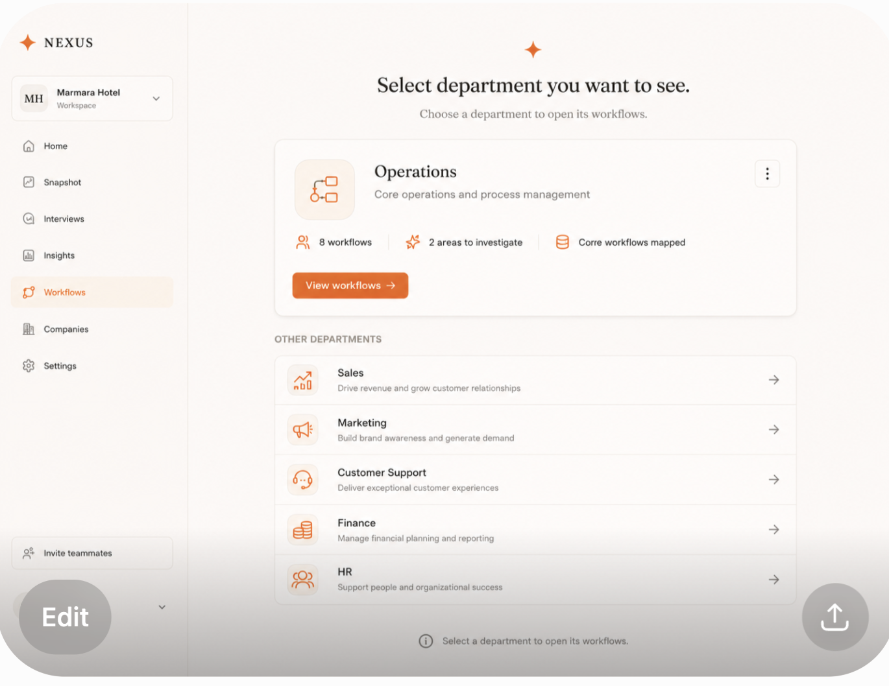

However, I prefer the alternative shown below: open the Workflows tab with “All” selected and use clear department icons or filters for Sales, Marketing, Operations, and other teams. This requires fewer clicks and makes browsing faster. Nexus may classify workflows by department when the context is clear, but it should never guess. If the department cannot be determined confidently, the workflow should remain under “All” or be marked as unclassified.

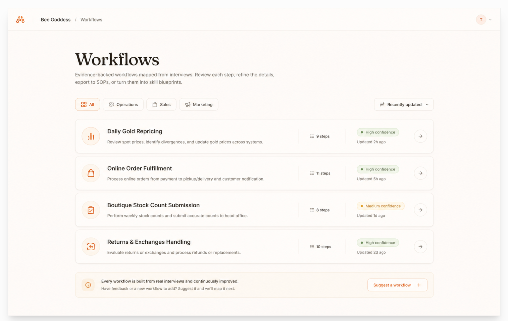

When a user selects a workflow, such as “Daily Gold Pricing,” the detail view should present the available context in a clear visual structure. The overview should help the user confirm that Nexus understands the process, while allowing them to open individual sections for more detail. We already capture significant context; the priority is presenting it clearly without hiding important information.

(Place Alternative UI Here)

Premium Nexus Workflows page with “All” selected, visual department filters, clear workflow cards, and an expandable Daily Gold Pricing detail view showing steps, owners, tools, decisions, and evidence.

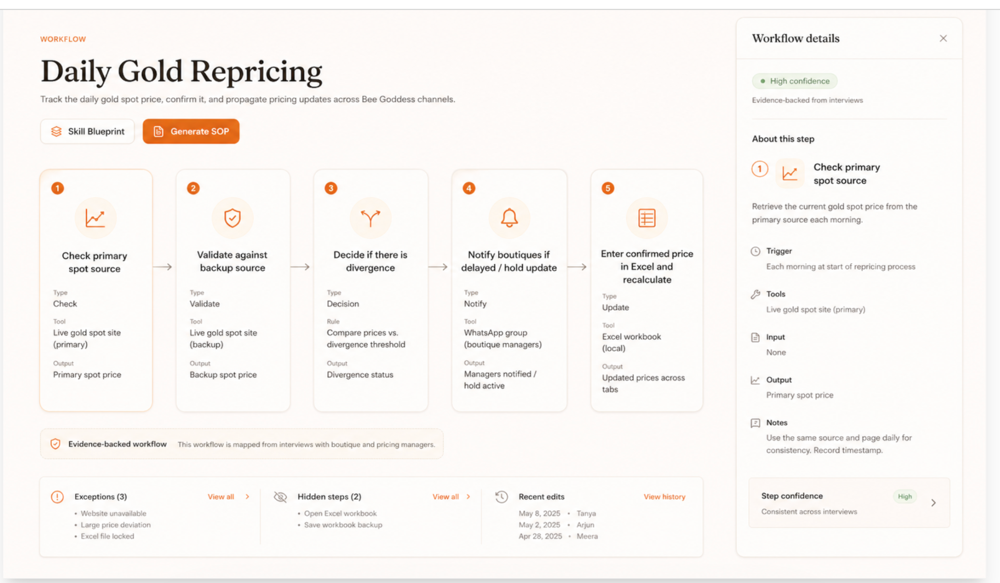

Feedback D

CEO Context-Call Experience

I created a new company and entered Baris, the CTO, as the person joining the call. I was testing the experience from his perspective. The current welcome message sounds as though Nexus is interviewing an employee. Because this is a leadership context call, the screen should explain that Nexus is learning about the company, its goals, and its operating context. It can also mention that Nexus may gather relevant publicly available information after the call. This is especially important while we strengthen the CEO context-call experience during the beta.

After the call has been created, Baris should see the following welcome screen:

(Place Alternative UI Here)

Premium Nexus leadership context-call welcome screen with tailored executive messaging, a clear purpose statement, privacy reassurance, expected duration, and one primary “Begin context call” button.

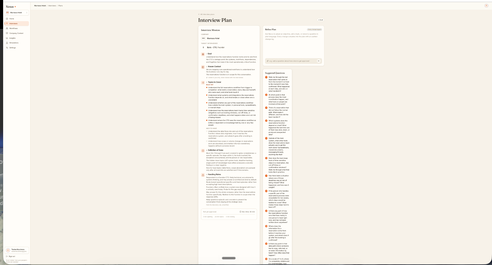

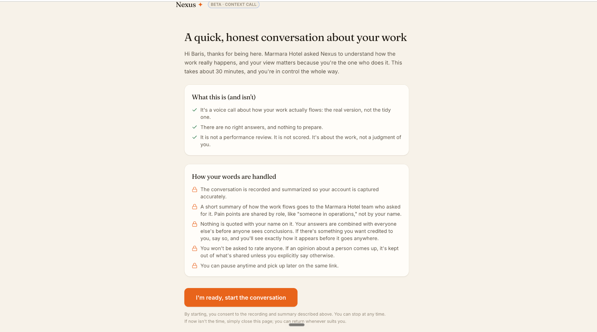

Feedback E

Live Call and Insight Capture

The chat currently feels slow, although the live transcript is smooth enough. On the right side, captured insights should appear in real time so the user can see what Nexus has saved. Each saved insight should have a clear confirmation checkmark.

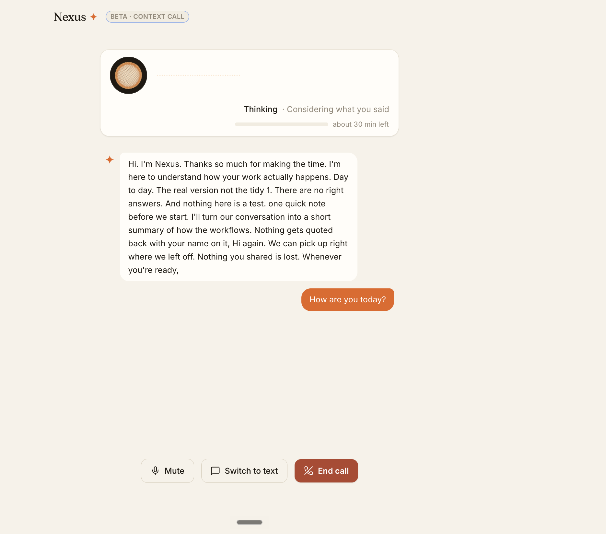

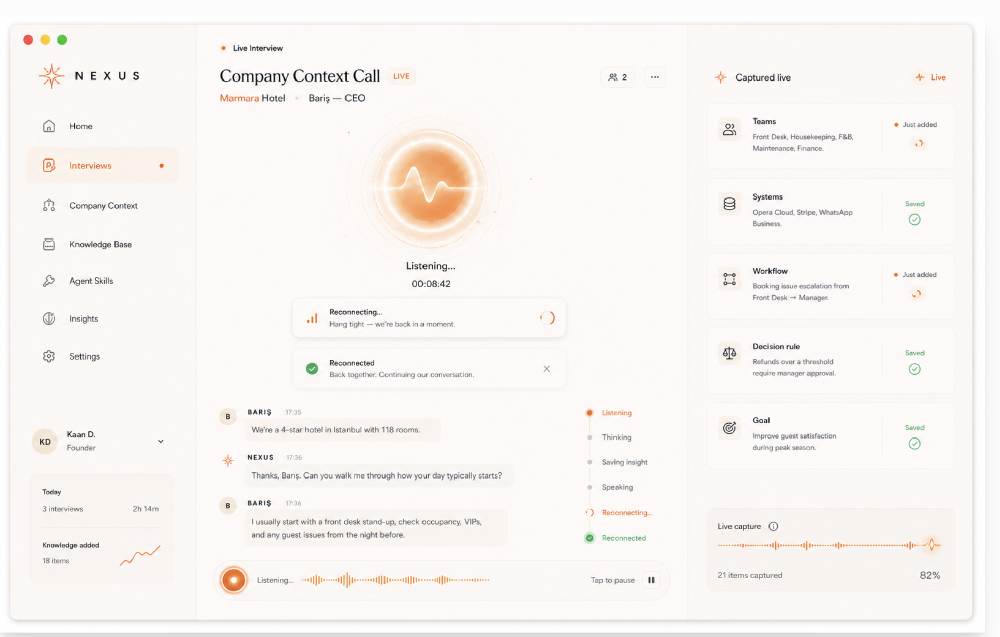

The redesigned call should feel more interactive and dynamic. On the right side, a “Captured live” panel should update as Nexus collects and organizes information. The interface should also show the agent’s current state—such as Listening, Thinking, or Saving—so the user understands what Nexus is doing. Transitions and motion should feel smooth, intentional, and physically natural rather than distracting.

Do not remove the left-side workspace navigation entirely. This interface should work for both executive context calls and participant interviews, with the copy, objectives, and captured information adapting to each interview type. The main goal is to upgrade the current voice-call experience while keeping it consistent with the rest of the Nexus workspace.

If the user prefers typing instead of speaking, the interface should switch to Text mode. The screen should clearly show “Voice is off” and “Text mode,” with the conversation displayed in the main panel. The right side should still show what Nexus is doing—Listening, Thinking, or Saving—and the “Captured live” insights should continue updating dynamically. Voice and text should feel like two modes of the same agent experience.

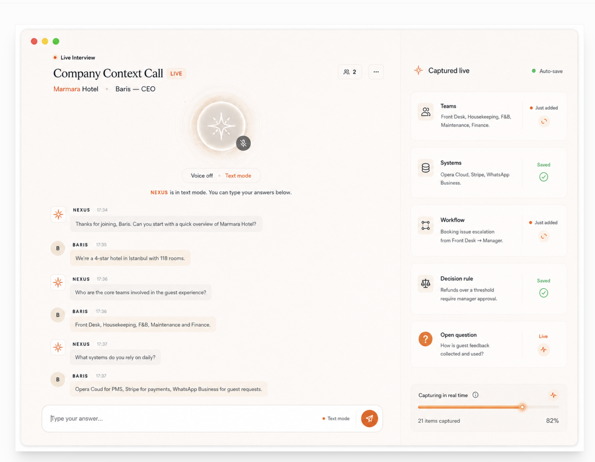

Feedback F

Call Connection Stability

The call connection currently cuts off unexpectedly, making the experience feel unreliable. Because the call interface is being redesigned in Feedback E, connection problems should be handled within that same experience. Show a clear but unobtrusive reconnecting state, preserve the conversation, and confirm when the connection has recovered.

(Place Alternative UI Here)

Nexus call interface in a subtle reconnecting state with preserved transcript, connection-quality indicator, automatic recovery message, and a clear manual retry option.

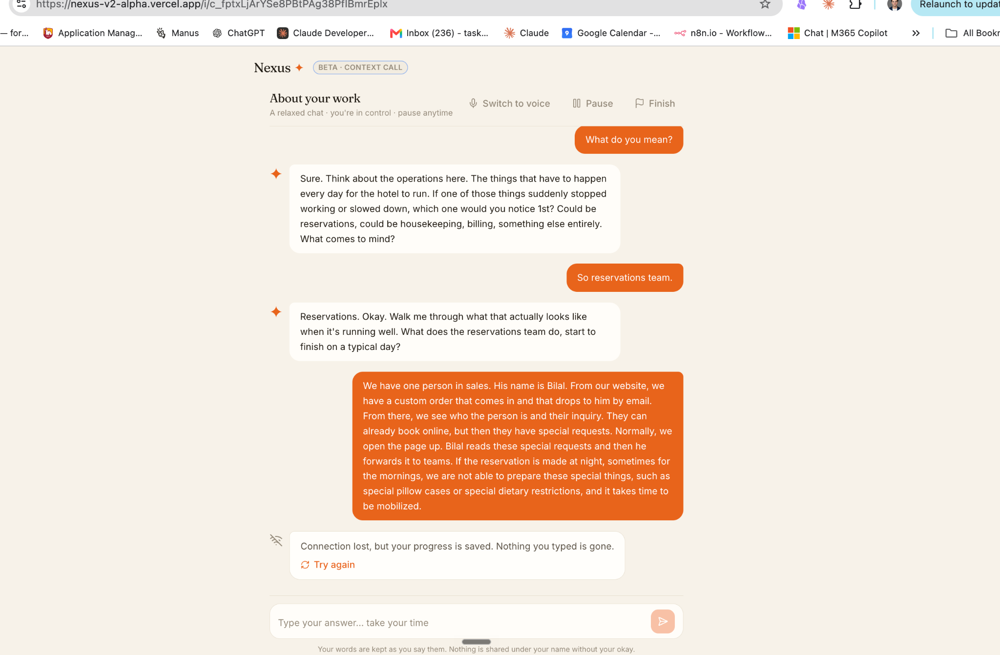

Feedback G

Call-Completed Screen

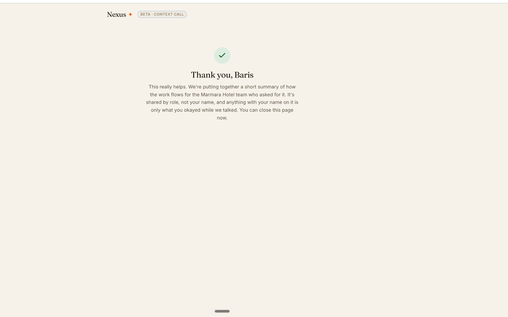

The call-completed screen needs a clearer next step. If this was the company’s first context call, the primary action should be “View company snapshot,” which opens the experience described in Feedback B. If this was an additional call created by the CEO to add more context, the primary action should return the user to the updated company snapshot or relevant workspace view. Include a secondary “Return home” action.

(Place Alternative UI Here)

Premium Nexus call-completed screen with a success confirmation, concise summary, context-aware primary action, and secondary “Return home” button.

,” and “Start follow-up call” actions with existing company context carried forward.

Feedback I

Simulation Experience

The Simulations page UI is still broken, and its value is unclear. It is also still tied to the jewelry example. Nexus should only suggest realistic workflows based on the company’s actual context. The page needs to explain what a simulation tests, why it matters, and how the user can run one quickly.

Premium Nexus simulation page with a clear value statement, realistic workflow selector, simple run controls, live validation steps, and a concise results summary.

When a simulation starts, it should open the same upgraded voice-and-text interaction interface described in Feedback E, adapted to the selected simulation scenario.

Simplify this, do this last after all othe rui’s to think the bets and smartest way tp do this

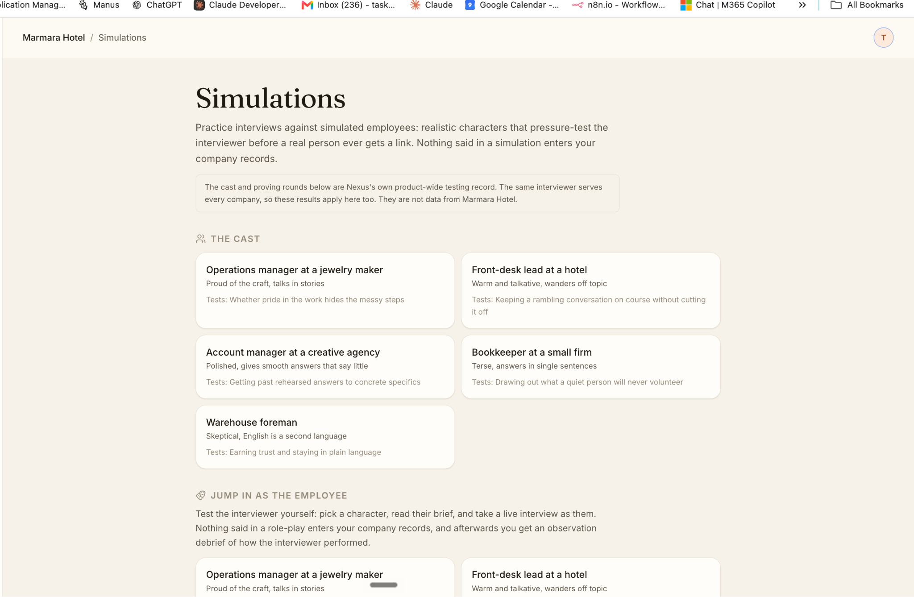

Feedback J

“Play This Character” Scenario

The “Play this character” interface is difficult to understand. Instead of showing the raw MD file by default, it should present a simple overview of the character and scenario. The user can then expand the details or open the full MD file if needed. A CEO should not have to read the entire technical file to understand the simulation.

Premium Nexus scenario card showing the character’s role, goals, context, and key behaviors, with expandable details and a secondary tab for the full MD file.

Feedback K

Interview Plans, Observation, and Reports

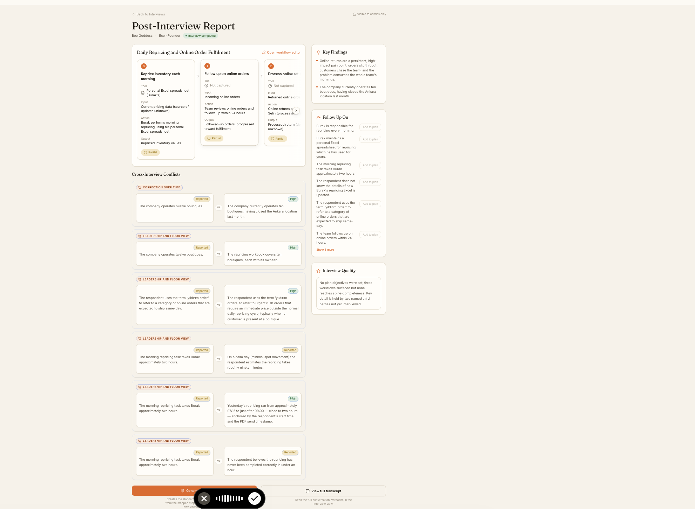

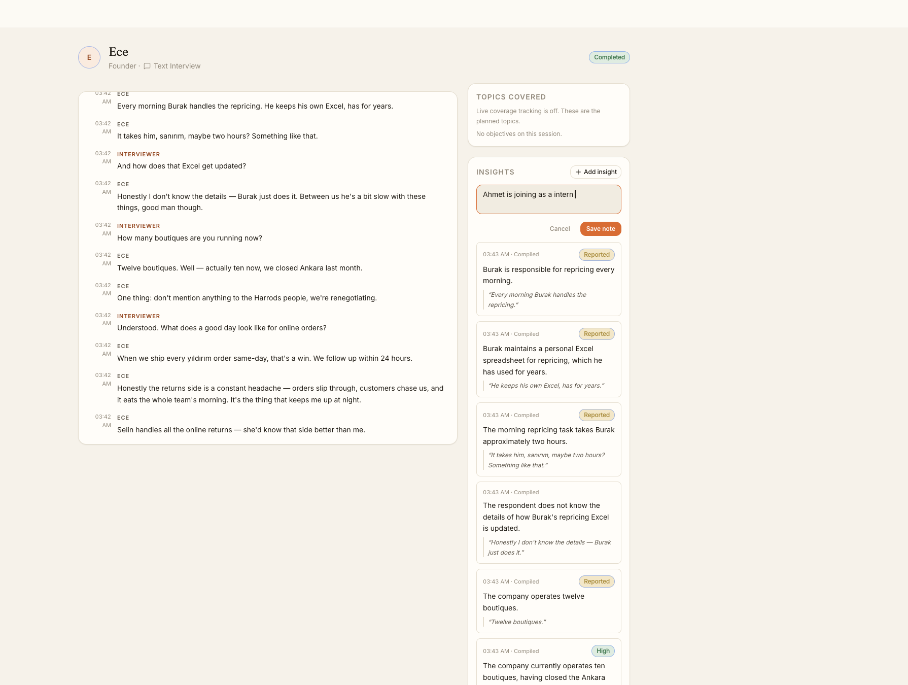

Overall, the Interview Plans and Interviews sections are too complicated. Opening an interview presents too many unclear options, making it difficult to understand what to do next.

The Observe view is cluttered and requires too much scrolling. Topic coverage is difficult to understand, and the transcript feels disconnected from the rest of the page.

The “View report” experience is also cluttered and difficult for a CEO to navigate or act on.

The “Follow-up plan” action and its next steps are unclear and do not currently make sense.

This entire experience needs to be reconsidered. The interview overview, live observation, final report, and follow-up plan should feel like connected stages of one simple workflow.

(Place Alternative UI Here)

Premium Nexus interview hub with four clear stages—Plan, Observe, Report, and Follow-up—using a clean timeline, concise status cards, minimal scrolling, and obvious next actions.

Also, when I click on New Interview, Interview Plan shows up, and then at the bottom we have Burak Selim and those other people. This is about creating a new interview, right, so you can assign an employee interview, and then here we have a chat function. What is it we want to happen here? Nexus from chat, a bit of back and forth, and as it's chatting, it's updating the interview plan.

Here it's a bit confusing, because maybe we have draft topics there, so just trigger normal path tools, etc., but you want to adapt it too based on what it is they're trying to do. This is going to be one of the hardest builds, I think, in how it can be updated dynamically.

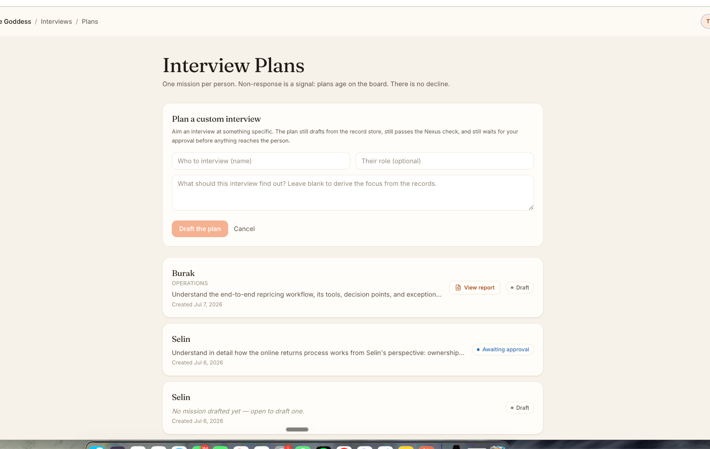

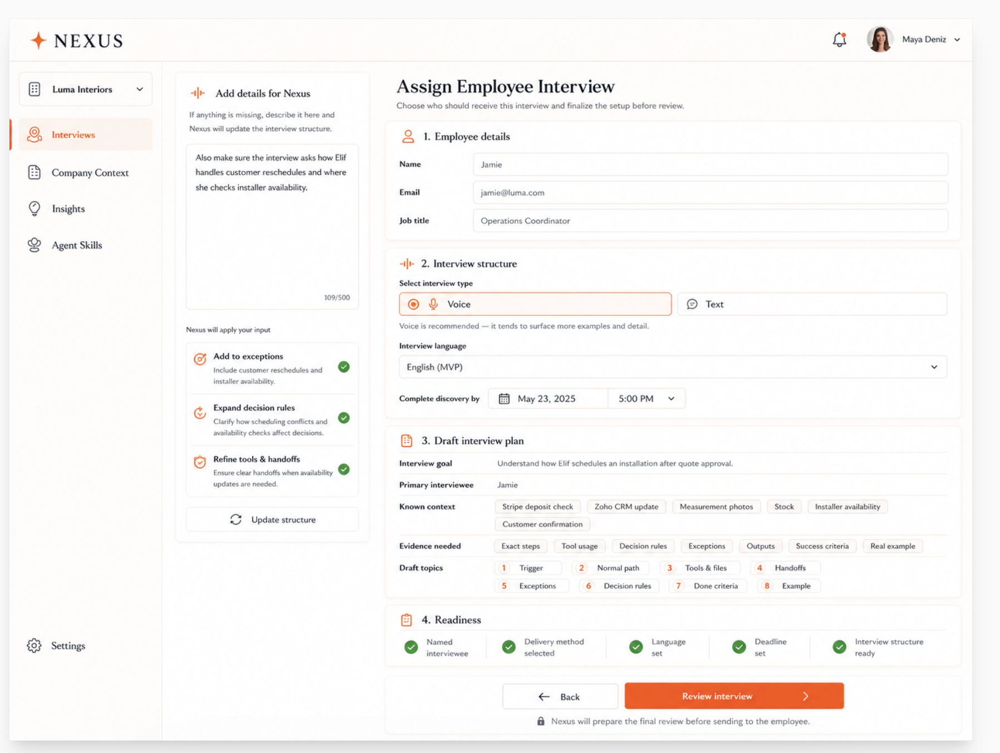

Also, as you can see here, when I added Kaan as an intern, the Goal, Known Context, Topics to Cover part, I think, is good. Define is done, but the UI is just so fucking messy, it's crazy. I suggested questions, and the spacing and sizing should be appropriate for a MacBook and mobile, and every section should be considered. It's actually embarrassing that our UI checker missed this yesterday. This looks terrible,  see at the bottom of this doc what that can look like better

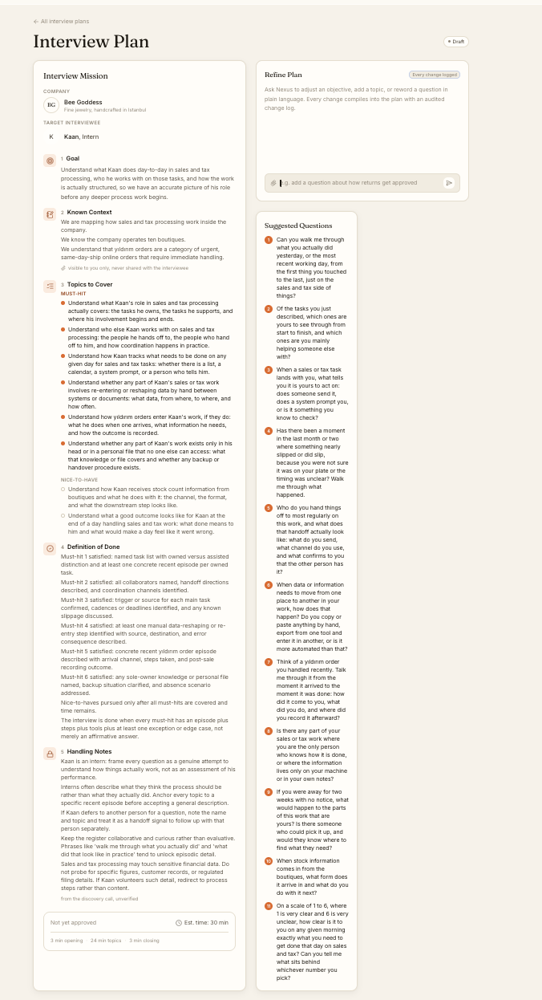

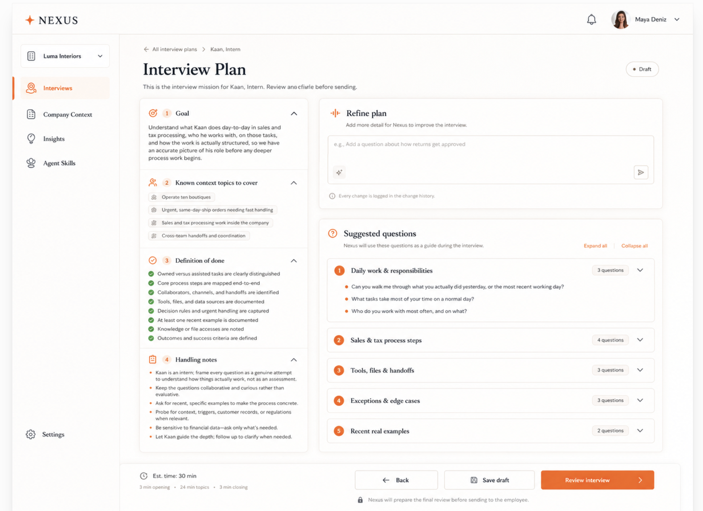
